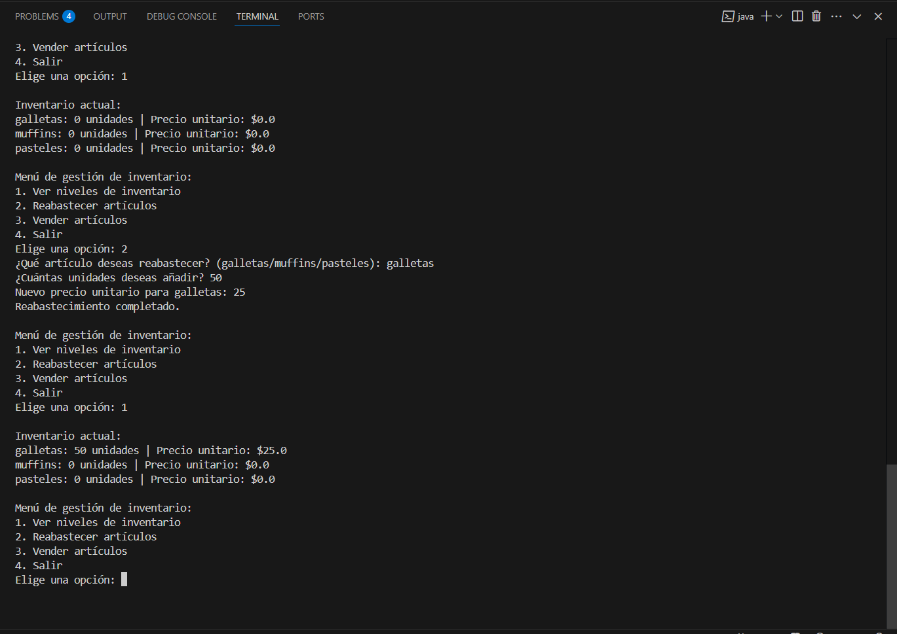

# Panadería - Gestión de Inventario

Este programa en Kotlin permite gestionar el inventario de una panadería, controlando la cantidad y el precio de galletas, muffins y pasteles.

## ¿Qué puedes hacer?

- **Ver niveles de inventario:** Consulta cuántos productos hay disponibles y sus precios.
- **Reabastecer artículos:** Añade unidades y actualiza el precio de cada producto.
- **Vender artículos:** Descuenta unidades del inventario y calcula los ingresos por ventas.

## ¿Cómo funciona?

Al ejecutar el programa, verás un menú con las siguientes opciones:

1. **Ver niveles de inventario:** Muestra el inventario actual.
2. **Reabastecer artículos:** Permite seleccionar un producto, añadir unidades y establecer un nuevo precio.
3. **Vender artículos:** Permite seleccionar un producto y vender una cantidad, siempre que haya suficiente stock.
4. **Salir:** Termina el programa.

El programa valida todas las entradas para evitar errores y asegurar que los datos sean correctos.



## Ejecución

Compila y ejecuta el archivo `panaderia.kt` con Kotlin:

```sh
kotlinc [panaderia.kt](http://_vscodecontentref_/0) -include-runtime -d [panaderia.jar](http://_vscodecontentref_/1)
java -jar [panaderia.jar](http://_vscodecontentref_/2)

